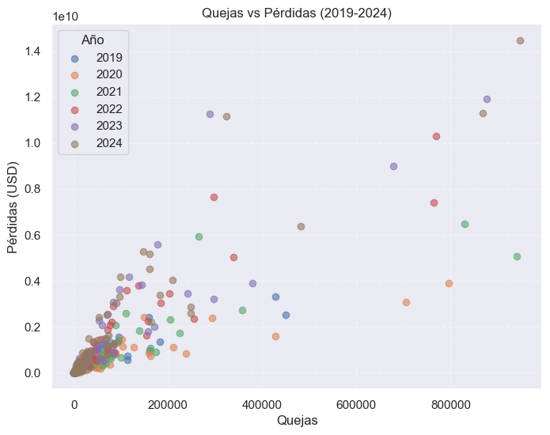
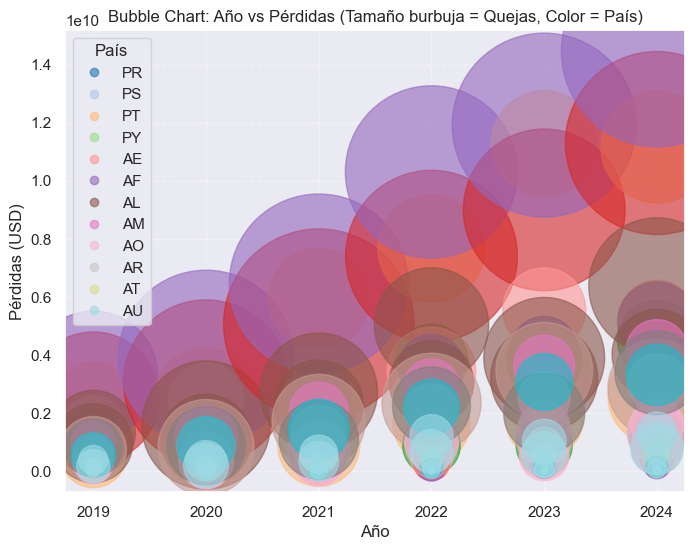

# 📊 Tratamiento de Datos de Incidentes de Ciberseguridad
*Maestría en Ciberseguridad – Grupo 11*
## 💡 Equipo de Trabajo
Integrantes:
* Jenny Alava
* Saskia Guerrero
* Angel Merino

Este repositorio contiene el análisis y visualización de incidentes de ciberseguridad utilizando Python (**Pandas**, **Matplotlib** y **Plotly**). El objetivo es explorar y mostrar la relación entre **quejas** y **pérdidas económicas** a nivel global en el período **2019–2024**.

## 📂 Estructura del Repositorio
- **`incidentes_ciberseguridad.ipynb`** → Notebook principal con procesamiento, análisis y visualización.
- **`interactive_bubble_year_losses.html`** → Animación *Quejas vs Pérdidas (2019–2024)*.
- **`interactive_scatter_complaints_losses.html`** → *Bubble Chart* Año vs Pérdidas (Tamaño = Quejas, Color = País).
- **`index.html`** → Portafolio público (GitHub Pages) con galería y secciones de Datos/Metodología y Reproducibilidad.
- **`data/`** → Dataset base `LossFromNetCrime.csv` (columnas tipo `YYYY_Complaints`, `YYYY_Losses` por país).
- **`README.md`** → Documentación del proyecto.
- **`requirements.txt`** → Dependencias mínimas para ejecutar el notebook.

## 📝 Flujo del Análisis (`incidentes_ciberseguridad.ipynb`)
1. **Carga de datos**: importación de `data/LossFromNetCrime.csv`.
2. **Transformación (long format)**: se genera `long_df` con columnas **Pais, Año, Quejas, Pérdidas**.
3. **Exploración (Matplotlib)**:
   - Scatter y bubble chart.
   - Leyenda con nombres/códigos reales de país usando `pd.factorize(Pais)` + etiquetas manuales (`ax.legend(handles, uniques)`).
4. **Visualizaciones interactivas (Plotly)**:
   - *Quejas vs Pérdidas (2019–2024)* con animación temporal.
   - *Bubble chart* Año vs Pérdidas con tamaño = Quejas, color = País.
5. **Exportación a HTML**:
   ```python
   import plotly.io as pio
   # Asegúrate de crear primero fig_scatter y fig_bubble
   pio.write_html(fig_scatter, file="interactive_scatter_complaints_losses.html", include_plotlyjs="cdn")
   pio.write_html(fig_bubble,  file="interactive_bubble_year_losses.html",       include_plotlyjs="cdn")

## 📌 Descripción del propósito del dataset  
El presente proyecto utiliza el dataset **Cybersecurity Incidents Dataset** (disponible en [Kaggle](https://www.kaggle.com/datasets/huzpsb/cybersecurity-incidents-dataset)), el cual recopila información relacionada con incidentes de ciberseguridad registrados en diferentes países.  

El propósito de este dataset es servir como base para el análisis de tendencias, patrones y posibles vulnerabilidades en el ámbito de la ciberseguridad. Su estudio permite comprender con mayor detalle los tipos de incidentes más frecuentes, los sectores más afectados y la evolución de estas amenazas.  

---

## 📎 Datos y Metodología (resumen)
- **Fuente:** `data/LossFromNetCrime.csv` con quejas y pérdidas por país y año (2019–2024).
- **Transformación:** apilado por año para formar `long_df (Pais, Año, Quejas, Pérdidas)`.
- **Limpieza:** convertir las columnas que deberían ser números (ej. Quejas, Pérdidas) pero que en el dataset vienen como texto (str) porque tienen comas, símbolos de dólar o valores faltantes, tratamiento de nulos, normalización de nombres de país.
- **Visualización:** Matplotlib (EDA) y Plotly (interactividad).

---

## 📊 Principales hallazgos del análisis  
- Se identificaron los países con **mayores pérdidas económicas** derivadas de incidentes de ciberseguridad, siendo Estados Unidos, India y China los que presentan una tendencia ascendente más pronunciada en los últimos años. El gráfico de líneas  evidencia cómo en estos países las pérdidas en dólares estadounidenses (USD) han crecido de manera sostenida, reflejando tanto el incremento en la frecuencia de incidentes como en la magnitud del impacto financiero.  
- Algunos **sectores presentan mayor vulnerabilidad** frente a ataques específicos, lo que sugiere la necesidad de medidas preventivas particulares.  
- Se observan **tendencias temporales**, con incrementos notables de ciertos incidentes en periodos concretos.  

---

## 📊 Visualizaciones
Se generaron las siguientes visualizaciones:
##  - Gráfico de líneas  
### Evolución de Pérdidas por País
El siguiente gráfico muestra la **evolución de las pérdidas económicas (USD) asociadas a incidentes de ciberseguridad por país** durante el periodo 2019–2024.  

Se observa que países como **Estados Unidos, India y China** presentan un crecimiento acelerado en el monto de pérdidas, lo que indica un aumento tanto en la **frecuencia** como en la **severidad de los ataques** en estas regiones.  
Este comportamiento refleja la concentración de ciberataques en economías altamente digitalizadas, donde la superficie de exposición es mayor y el impacto financiero de los incidentes es significativo.  

El análisis permite identificar patrones de riesgo y priorizar medidas de ciberseguridad a nivel internacional.  


  - Histogramas → .
  - Boxplots → .

## **📊 Heatmap de correlación (Seaborn)**.
### **📌Quejas vs Pérdidas (2019–2024) por año**
  >Te permite ver si los países con más quejas también presentan más pérdidas, comparando entre años.
  Crea un scatterplot donde:    
   - Eje X = número de quejas.  
   - Eje Y = pérdidas económicas (USD).  
   - Cada color representa un año distinto (2019–2024).  
   

### **📌Bubble Chart: Año vs Pérdidas (size=Quejas, color=Pais)**
  >Esto te deja ver qué países tienen más pérdidas en cada año y con cuántas quejas se relaciona.  
   Crea un gráfico de burbujas donde:  
   - Eje X = Año.  
   - Eje Y = Pérdidas (USD).  
   - Tamaño de la burbuja = número de quejas.  
   - Color = país.  
   

### 📌Graficos Animados
* <a href="https://rawcdn.githack.com/anmerinoto/Tramiento_Datos_Incidentes_Ciberseguridad/0771bb7f2ddde5caf8a872883d0ed0980382e355/interactive_scatter_complaints_losses.html" target="_blank" rel="noopener noreferrer">Quejas vs Pérdidas (2019–2024) – animación por año</a>
* <a href="https://rawcdn.githack.com/anmerinoto/Tramiento_Datos_Incidentes_Ciberseguridad/33ed7b3e206422753d61405d1e1a9235fa5d5980/interactive_bubble_year_losses.html" target="_blank" rel="noopener noreferrer">Bubble Chart: Año vs Pérdidas (size=Quejas, color=Pais)</a>

### Gráfico de barras → .

---

## 💡 Insights y conclusiones  
- La **distribución de incidentes por tipo** evidencia que la mayor parte se concentra en un número reducido de categorías, lo cual permite priorizar medidas de mitigación en esos ámbitos.  
- Los datos muestran que la **conciencia en ciberseguridad y las políticas de protección** juegan un papel clave en la reducción de riesgos.  
- Este análisis puede ser un punto de partida para diseñar **modelos predictivos** que anticipen posibles incidentes en función de patrones históricos.  

---

## 💡 Repositorio
Este repositorio contiene:
- data/ → dataset original.
- images/ → visualizaciones.
- root → análisis exploratorio, notebook y procesamiento.
- README.md → documentación del proyecto.
